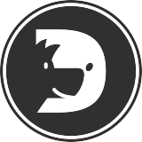

[](https://github.com/axetroy/watchdog/actions)
[](https://goreportcard.com/report/github.com/axetroy/watchdog)


看门狗，一个服务监听者，监听各种协议的服务是否在线，然后通过各种渠道通知开发者

支持监听的协议包括:

- [ ] ftp
- [ ] sftp
- [x] http/https
- [ ] nfs
- [ ] pop3
- [ ] smb
- [ ] smtp
- [ ] ssh
- [x] tcp
- [x] udp
- [x] websocket

支持通知的渠道

- [x] Webhook
- [ ] 邮件(pop3/smtp)
- [x] 微信
- [ ] 企业微信

### 使用

```bash
watchdog --config=./config.json
```

### 安装

If you have installed nodejs, you can install it via npm

```bash
npm install @axetroy/watchdog -g
```

If you are using Linux/macOS. you can install it with the following command:

```shell
# install latest version
curl -fsSL https://raw.githubusercontent.com/axetroy/watchdog/master/install.sh | bash
# or install specified version
curl -fsSL https://raw.githubusercontent.com/axetroy/watchdog/master/install.sh | bash -s v1.3.0
# or install from gobinaries.com
curl -sf https://gobinaries.com/axetroy/watchdog@v1.3.0 | sh
```

Or

Download the executable file for your platform at [release page](https://github.com/axetroy/watchdog/releases)

### 从源码构建

Make sure you have `Golang@v1.16.x` installed.

```shell
$ git clone https://github.com/axetroy/watchdog.git $GOPATH/src/github.com/axetroy/watchdog
$ cd $GOPATH/src/github.com/axetroy/watchdog
$ make build
```

### 测试

```bash
$ make test
```

### 开源许可

The [MIT License](LICENSE)
