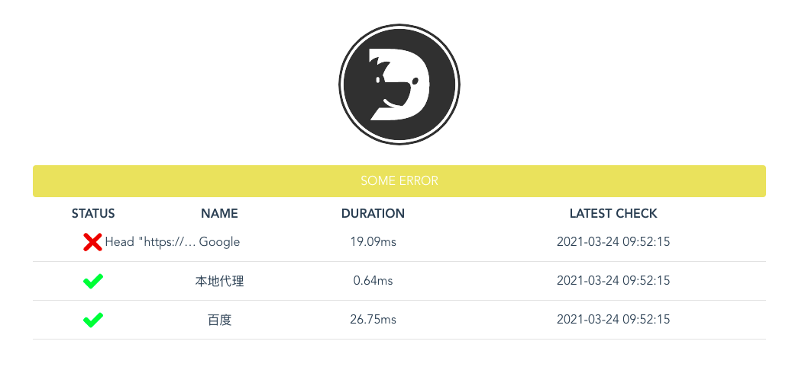

    

<h1>看门狗 - 您的服务状态管家</h1>

[文档](docs.md) |
[变更日志](CHANGELOG.md) |
[贡献代码](CONTRIBUTING.md)

看门狗，一个服务监听者，监听各种协议的服务是否在线，然后通过各种渠道通知开发者。

服务在线有保障，睡的更香，头发不再掉。

### 开源许可

The [Anti-996 License](LICENSE)
